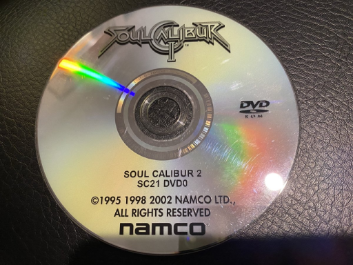
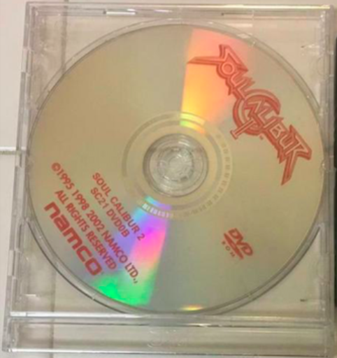
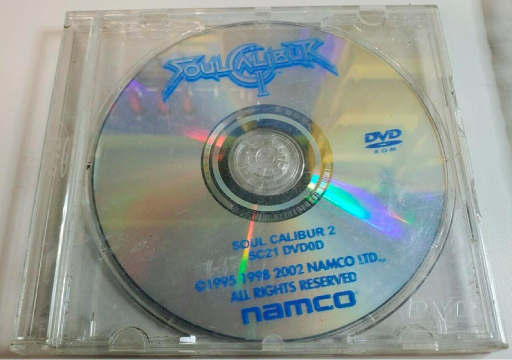

This is how the several Game dongles and discs look like. in case you need to identify them

## Disc

=== "SC21 DVD0"
    

=== "SC21 DVD0B"
    

=== "SC21 DVDD"
    ???+ info "Conquest mode enabled by default"
        When using this version of the disc, conquest mode is instantly available. seems like the other disc versions were designed to lock conquest mode until a certain time span was spent
    

## Dongle
The dongle label will be composed of two parts, separated by a comma
like in this dongle


```
SC21, Ver.A
```

- SC21: JAPAN
- SC22: WORLD
- SC23: USA

then you have the version. it can be 'A', 'C' or 'D' (there are no picture of the Version D. but text references to it were found on certain lists of Sys246 games)

## Conquest Card


<div class="grid" markdown>


</div>