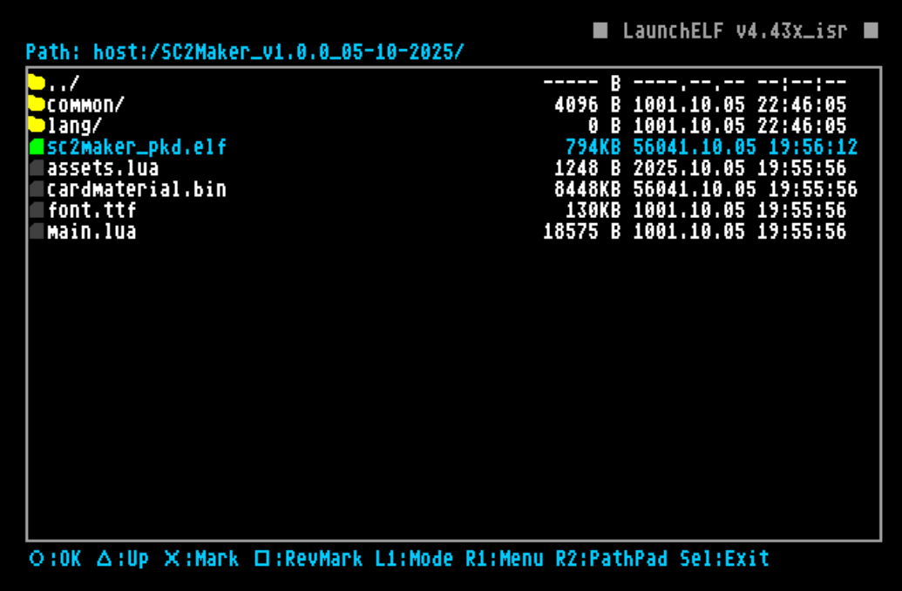
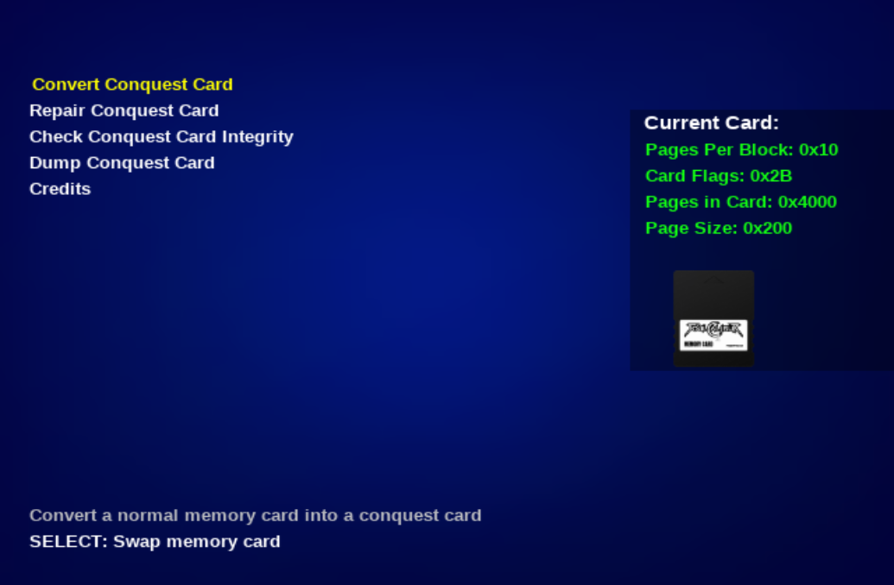
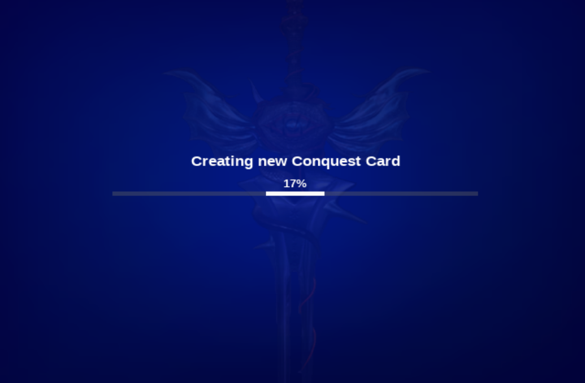

The functionality of the program is relatively easy, but here we will explain a bit to make sure you undestand how to get this going...

first of all, you will need the following things:
<div class="annotate" markdown>


<li> A jailbroken PS2 or a Jailbroken System246 (jailbroken: it can execute wLaunchELF (1), does not matter how)  
<li> a USB storage device with at least 16mb free (2) (or an SD2PSX/PSXMemCardGen2 if you have wLaunchELF version that can browse it's SDCard)  
<li> All the needed things to run SoulCalibur2 to check if the converted card works (not covered here)


</div>

1. a PS2 filebrowser and app launcher
2. Can be FAT32 or EXFAT. depending if your app launcher reads EXFAT or not

Ok, now let's get into it:

## Setup files

First of all, download the SC2Maker program. it will be a 7zip file. you can unpack it on the USB (or the SD2PSX/PSXMemCardGen2 SDCard) with 7zip. most of the files are contained inside a directory, so simply using "extract here" should be OK, it will not flood you with files

after unpacking, you should see some directory tree like this:
```
│   LICENSE
│   README.md
│
└───SC2Maker_v1.0.0_05-10-2025/
    │   assets.lua
    │   cardmaterial.bin
    │   font.ttf
    │   main.lua
    │   sc2maker_pkd.elf
    │
    ├───common/
    │       ...
    │
    │
    └───lang/
            ...
```

## Run the program

now it's time to run the program! hook up your USB or SD2PSX into the console/arcade and launch wLaunchELF (in whatever way you can, it is not covered in this tutorial)
Once you are in, locate the place where you unpacked the zip. 

!!! note "WlaunchELF devices"

    Although the program supports to be ran from a bunch of devices. We strongly recommend running from an SD2PSX or a USB.  
    `mass:` means USB storage. `mmce0:` and `mmce1:` are the SDCards inside the SD2PSX (if you are using one)

once you are there, hover the `sc2maker_pkd.elf` and press OK (X or Circle depending on wLaunchELF settings)


## Inside the program

after a little opening. you should arrive at the program main menu, wich looks like this:



Let's explain what we see here:  

On the top left side you have the menu options, each one has a description on the lower left side  

on the right side, you can see the current memory card, with the specifications written on text, and a little image representing wich kind of card is detected:

- if it shows a black card, it's a PS2 memory card with normal filesystem
- if the memory card has a SoulCalibur label. it is a PS2 memory card with conquest card Filesystem
- if it shows a dark outline with a question mark. it means it's a PS2 card with an unrecognized filesystem. most likely corrupt

???+ note "Changing Cards"

    As the program explains when starting up. due to the unique format of the conquest card, special methods were made to handle them  
    And thanks to that, you may only change the cards you're working with by letting the program know, pressing **SELECT**, then doing the card swap, and pressing **SELECT** again

## Let's convert a card

Now, what about transforming a card?

If you haven't done it yet, insert the card you want to convert (use the SELECT button as explained before!)

Once you have the desired memory card plugged on second card port, go ahead and press X on the "Convert Conquest Card" option.

The program will ask you to confirm again by pressing X once more.

After that, you shall see the convertion process begins and a progress bar showing up on the screen, like this:



Once the process is finished, program will let you know, and you will return to main menu by pressing any button

From here, you could just unplug the card and take it to your system246, fire up SoulCalibur2 and see if it works

!!! tip "Checking card integrity after convertion"

    When this program converts a conquest card, it manually corrects the ECC at the moment of programming it. this means that a freshly converted conquest card clone **should never have even a single mismatch** when scanning it with the integrity check feature

## fixing the card encryption 

the conquest card seems to use some sort of encryption for the player data, because of this, the card you just converted is not ready to play.  
due to not having the valid encryption for the player data, trying to start a match right now will make the game hang on a white screen

to workaround this, we need to let the game fix the encryption.

to do so, run the game with the cloned conquest card plugged, as soon as you the game starts, activate the dip switch 1 of your system246 to enter the game's TESTMODE.

from there, go to clear data option and select the last option (bottom), confirm if the program asks.

what this will do is reset to default all settings and schedule a conquest card reset for the following game reboot

before saving changes in TESTMODE, set back your settings, like Freeplay for example.

when you're ready, save settings, the game will reboot.

this time, the "checking memory card" screen will take like 5 seconds longer than usual, this is because the game is resetting the game data, wich implicitly fixes the encryption of our cloned card.

now your card is ready to play! have fun!!!
